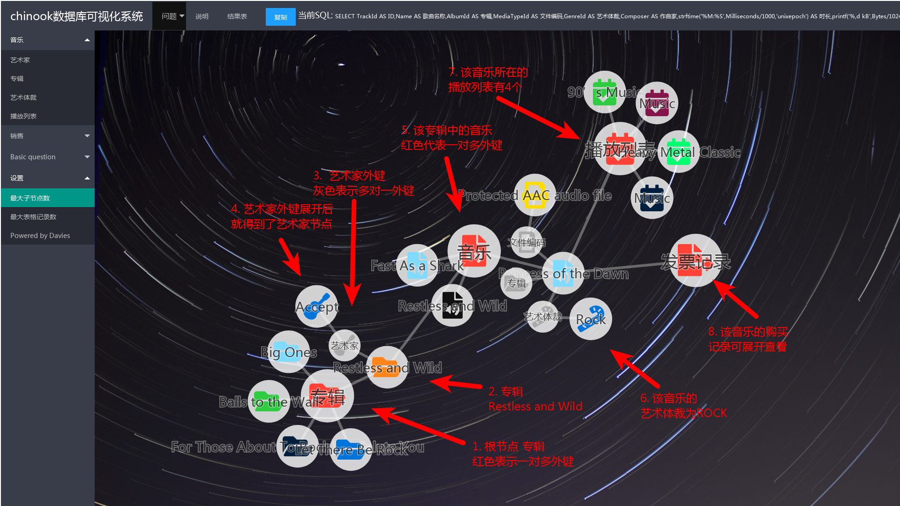

[![MIT License][license-shield]][license-url]


<br />
<p align="center">
  <a href="https://github.com/DaviesGit">
    
  </a>

  <h3 align="center">Maked by Davies</h3>

  <p align="center">
    Email: 1182176003@qq.com
<!--     <br />
    <a href="https://github.com/DaviesGit"><strong>Explore the docs »</strong></a>
    <br />
    <br />
    <a href="javascript:void(0)">View Demo</a>
    ·
    <a href="javascript:void(0)">Report Bug</a>
    ·
    <a href="javascript:void(0)">Request Feature</a> -->
  </p>
</p>


<!-- TABLE OF CONTENTS -->
## Table of Contents

* [About the Project](#about-the-project)
  * [Built With](#built-with)
* [Getting Started](#getting-started)
  * [Prerequisites](#prerequisites)
  * [Installation](#installation)
* [Usage](#usage)
* [功能定制](#功能定制)
* [Roadmap](#roadmap)
* [Contributing](#contributing)
* [License](#license)
* [Contact](#contact)
* [Acknowledgements](#acknowledgements)
* [免责声明](#免责声明)


<!-- ABOUT THE PROJECT -->
## About The Project

系统结构


DFD


ERD


软件主界面


结果表


节点展开




`chinook_system`是我们数据库的课外作业。我利用`d3.js`将`chinook`数据库在网页端进行了可视化展示。该系统基于 `web` 开发，底层的查询数据库连接查询功能使用 `C++`开发，能够做到跨平台使用。本系统采用开源的 `Chinook 数据库`作为数据源,该数据库符合`第一范式`、`第二范式`、`第三范式`和 `BC
范式`的要求。我们在该数据库上创建了两个 VIEW,方便进行查询操作。


功能:

* 数据可视化
* 可执行自定义SQL
* 集成了 `Chinook 数据库`的问题答案
* 更多请参考`开发文档.pdf`


### Built With
依赖
* [Font Awesome](https://fontawesome.com/)
* [D3.js - Data-Driven Documents](https://d3js.org/)
* [jQuery](https://jquery.com/)
* [cpp-httplib: A C++ header-only HTTP/HTTPS](https://github.com/yhirose/cpp-httplib)


<!-- GETTING STARTED -->

## Getting Started

这个章节将指导你简单的部署和使用该软件。

### Prerequisites

这个项目的依赖安装步骤在下面给出。
* 无


### Installation

1. Clone the repo
```sh
git clone https://github.com/path/to/the/repository
```

2. 进入`chinook_system`文件夹

> 你也可以自行编译`chinook_server`。服务器源码在`server`文件夹中。


<!-- USAGE EXAMPLES -->

## Usage

1. 运行`./chinook_server`
2. 打开网址[http://localhost:8080/](http://localhost:8080/)
3. Good luck!


## 功能定制

如果需要功能定制，请联系作者 [1182176003@qq.com](1182176003@qq.com)


<!-- ROADMAP -->

## Roadmap

See the [open issues](https://example.com) for a list of proposed features (and known issues).


<!-- CONTRIBUTING -->
## Contributing

Contributions are what make the open source community such an amazing place to be learn, inspire, and create. Any contributions you make are **greatly appreciated**.

1. Fork the Project
2. Create your Feature Branch (`git checkout -b feature/AmazingFeature`)
3. Commit your Changes (`git commit -m 'Add some AmazingFeature'`)
4. Push to the Branch (`git push origin feature/AmazingFeature`)
5. Open a Pull Request


<!-- LICENSE -->
## License

Distributed under the MIT License. See `LICENSE` for more information.


<!-- CONTACT -->
## Contact

Davies - [@qq](1182176003) - 1182176003

Davies - [@email](1182176003@qq.com) - 1182176003@qq.com

Project Link: [https://example.com](https://example.com)


<!-- ACKNOWLEDGEMENTS -->
## Acknowledgements
* [GitHub](https://github.com/)
* [Font Awesome](https://fontawesome.com)


## 免责声明
* 该软件中所包含的部分内容，包括文字、图片、音频、视频、软件、代码、以及网页版式设计等可能来源于网上搜集。

* 该软件提供的内容仅用于个人学习、研究或欣赏，不可使用于商业和其它意图，一切关于该软件的不正当使用行为均与我们无关，亦不承担任何法律责任。使用该软件应遵守相关法律的规定，通过使用该软件随之而来的风险与我们无关，若使用不当，后果均由个人承担。

* 该软件不提供任何形式的保证。我们不保证内容的正确性与完整性。所有与使用该软件的直接风险均由用户承担。

* 如果您认为该软件中所包含的部分内容侵犯了您的权益，请及时通知我们，我们将尽快予以修正或删除。


<!-- MARKDOWN LINKS & IMAGES -->
<!-- https://www.markdownguide.org/basic-syntax/#reference-style-links -->

[license-shield]: readme_images/MIT_license.svg
[license-url]: https://opensource.org/licenses/MIT

[product-screenshot]: readme_images/screenshot.png
